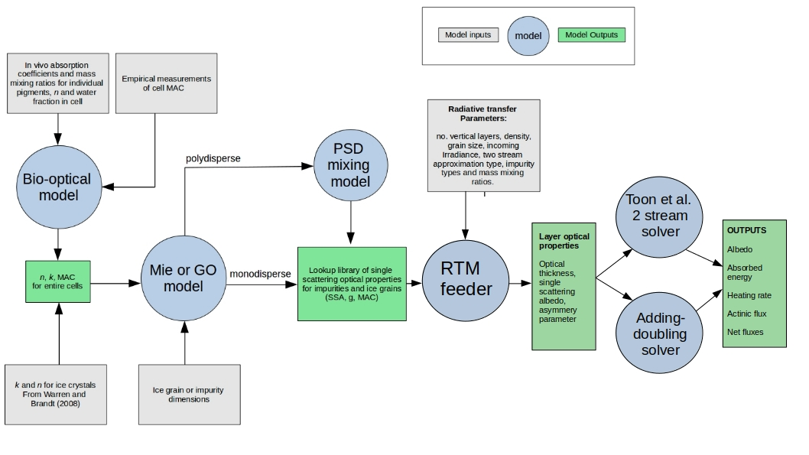
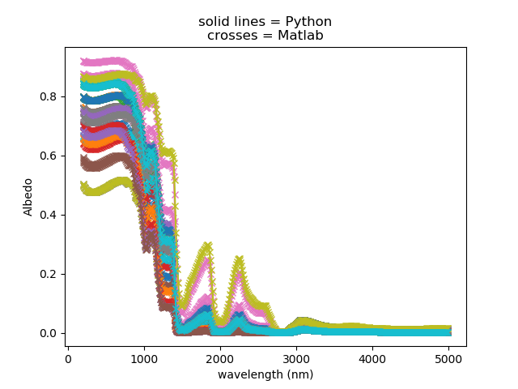

# BioSNICAR


<b>NOTICE (Jan 2022): We have done a lot of work refactoring and updating this code recently to make it cleaner, faster and more user-friendly. Some of the docs are currently lagging behind - we are working on this - please bear with us! </b>


## Introduction

BioSNICAR is a set of Python scripts that predict the spectral albedo of snow and/or glacier ice given information about the illumination conditions, ice structure and the type and concentration of particulates. The jumping off point for this model was legacy FORTRAN and Matlab code developed by Flanner et al. (2007), Cook et al. (2017, 2020) and Wicker et al. (2022). The model is a two-stream radiative transfer model. Two solvers are available: the original SNICAR matrix solver typically representing ice and snow with grains (Toon et al. 1989) and the Adding-Doubling (AD) solver (Brieglib and Light, 2007; Wicker et al. 2022) representing the ice as a solid medium with air bubbles and allowing the incorporation of Fresnel reflecting layers. BioSNICAR was originally developed in parallel to a set of bio-optical models that allowed for the incorporation of snow and glacier algae as light absorbing particles (Cook et al. 2017). This functionality, along with the vectorized model formulation, accessible user interface and applicability to a very wide range of surface conditions are the unique selling points of this implementation. This code is also very actively maintained and we welcome contributions from the community to help make BioSNICAR a useful tool for a diverse range of cryosphere scientists.

## How to use

### Environment/Dependencies

First set up a Python environment. If you do not have Python installed, download Python >3.6. It is recommended to use a recent Anaconda distribution for easy environment management. However, if you have a regular Python installation already and want to use that, the following instructions can easily be adapted for venv instead of conda.

It is recommended to run this code in a fresh environment as follows:

```
conda create -n BioSNICAR_py python 3.6.8, numpy, scipy, matplotlib, pandas
conda install xarray dask netCDF4 bottleneck
pip install miepython

```

or alternatively linux users can create from the yaml file provided in this repository.

```
conda env create -f BioSNICAR_py.yaml

```

If creating a new environment in this way, please remember to update the prefix in the final line of the file to something appropriate to the new local machine. The .yaml file has been tested on Ubuntu 16.04 and 20.04. 

Finally, if you do not wish to install anything on your computer, but you use VSCode and Docker, then you can use the devcontainer config provided to run this code in a remote container. This requires the "remote containers" extension to be added to VSCode. Further instructions are available here: https://code.visualstudio.com/docs/remote/containers


### Running the model
The model driver and all the core source code can be found in `/src`. From the top level directory (`~/BioSNICAR_GO_PY`):

`python ./src/snicar_driver.py`

This will run the model with all the default settings. The user will see a list of output values printed to the console and a spectral albeod plot appear in a separate window. The code can also be run in an interactive session (Jupyter/iPython) in which case the relevant data and figure will appear int he interactive console. 

Most users will want to experiment with changing input parameters. This is achieved by opening `snicar_driver.py` and adjusting the parameter values therein. The nature of each parameter is described in in-line annotations to guide the user. Invalid combinations of values will be rejected by our error-checking code. The user also has the option to change the model meta-config, which controls behaviour such as printing band ratio values to the console, savign the model config to external text file, togglign plottign on and off, etc. Most users should have no reason to modify any other file in this repository except for the clearly marked values in `snicar_driver.py`.

More complex applications of the model code, for example model inversions, snicar-as-a-function, field/model comparisons etc are included under `/experiments`, with details provided in that module's own README.

## Theoretical Background
### Snow and ice 

The snow and ice single scattering properties can be generated from the ice refractive index (Warren 1984, Warren and Brandt 2008, Picard 2016) using Mie scattering (good for fine snow grains that can be assumed spherical, or for representing ice bubbles in an ice matrix) or geometric optics (adapted from van Diedenhoven (2014), good for wet snow and ice). This also enables different grain shapes to be used - geometric optics for hexagonal plates and columns, Mie scattering for spheres, spheroids, hexagonal plates and Koch snowflakes (after He et al. 2016, 2017). The rationale behind providing GO functionality is that geometric optics enables ice grains shaped as large hexagonal plates and columns to be simulated, whereas Mie scattering applies to small spheres. Note that running the model in Mie mode with spherical grains and omitting any biological particles is equivalent to running the original SNICAR model of Flanner et al. (2007, 2009). Since 01/05/2020 there exists an option to model the effects of liquid water coatings around ice grains using two-layer coated sphere Mie calculations (added by Niklas Bohn). This option had previously been included in the Matlab version of BioSNICAR and was deprecated for the Python translation in favour of increasing ice grain radii to simulate interstitial melt water; however, it was subsequently decided that giving the choice of method for incorporating liquid water was a better approach. Gratitude to Niklas for adding this feature.  For each layer, the density has to be indicated together with the shape, coating and size of the grains (ice or air bubbles).

### LAPs

The LAPs single scattering properties can be also be generated using Mie theory (good for mineral dust or snow algae) or geometric optics (good for glacier algae that are long chains of cells approximated as cylinders after Lee and Pilon, 2013). In particular, the BioSNICAR_GO package includes a BioOptical model designed to generate the optical properties of snow and glacier algae cells and store them in a file directly usable in the main driver. The user needs to prescribe algae dry density, real part of refractive index and cell size for the calculation of the scattering properties, and for the calculation of extinction properties the cells are assumed homogeneous so that they are directly calculated from absorption cross sections (ACS), prescribed by an empirical measurement or a pigment profile (cellular pigment concentrations) from which the ACS is reconstructed following Cook et al. 2017, Pottier et al. 2005. The ACS of both glacier and snow algae are to date only theoretically reconstructed from pigment profiles.
The mineral dusts included in this version include four "global average" dusts with typically Saharan optical properties as described by Flanner et al. 2009. There are three Greenland Ice Sheet mineral dusts that were generated from field measurements of local mineralogy on the south-western sector of the ice sheet near Kangerlussuaq. The optical properties for each mineral was obtained from the literature and mixed according to the measured relative abundance using the Maxwell-Garnett mixing model, and the optical properties predicted using Mie theory over a measured particle size distribution. There are also three additional Greenlandic dusts from Polashenski et al. (2015) who generated hypothetical dust samples with low, medium and high hematitie content, with the remainder being similar to dusts collected on Greenlandic snow. Black carbon is included in both sulphate-coated and uncoated forms, and volcanic ash is included as per Flanner et al. (2009).

## Recent Additions

There have been several additions to the BioSNICAR model that have not yet been documented in any publication paper. These include:

### 1) Refactor of bio-optical model
The bio-optical model was refactored into a much more useable format. Hard coded variables were moved into the function call, the two bio-optical components (the mixing model and mie/go code) ware now controlled from a single driver script, and file paths were all synchronised.

### 2) Update of glacier algae optical properties
The new glacier algal optical properties account for intracellular protein attachment and packaging of pigments into specific regions of the cell rather than assuming uniform distribution through the cell using a linear correction.
 
### 3) Addition of liquid water films
Thanks to Niklas Bohn to incorporating liquid water films of user-defined thickness to the model. This is controlled by providing a value for r_water when running the model in Mie mode and the optical properties are then calculated using a coated-spheres model.

### 4) October 2020: Addition of aspherical grains
Adjustments to the single scattering optical properties of the ice grains resulting from variations in grain shape have been added to the model when run in Mie mode - running in GO mode assumes hexagonal columnar grains. These adjustments are from He et al. (2016) and enable the modelling of spheroids, hexagonal plates and Koch snowflakes.

### 5) November 2020: Addition of adding-doubling solver leading to solid ice layers and fresnel reflection
A second option for the treatment of multiple layers was added in October 2020. The user can now opt to include solid ice layers with fresnel reflections at their surfaces and solve the radiative transfer using the adding-doubling method as an alternative to the Toon et al (1989) matrix inversion method that was previously used that cannot include fresnel reflection and refraction. The A-D solver is pretty much a direct translation of the Matlab code written by Chloe Whicker (UMich) who in turn built on work by Dang et al. (2019). The solid ice layers can be positioned anywhere in the vertical profile, meaning unweathered ice beneath an increasingly porous weathered crust can now be realistically simulated.

### 6) November 2020: removed separate scripts for GO and Mie modes and synthesised into single SNICAR_feeder script, extended model to 200nm and enabled GO ice crytals in AD mode
Model now runs across 480 wavelengths between 200 - 5000 nm in all configurations, including GO.
The model now works using a single call to a snicar feeder script where the various radiative transfer properties (tau, SSA, g etc) are calculated and then passed to one of the two solvers.

### 7) January 2021: added testing scripts for comparing new code against matlab benchmarks. Extend spectral range of all model modes to 200nm
Reorganised directory structure to gather all testing scripts and data into the folder "Unit_Tests". Using Whicker/Flanner's Matlab code as benchmark for testing Python code.

### 8) September 2021: Bio-optical model renewed, new units
The bio-optical model was updated into a much simpler and user-friendly format that can be run from a short driver script. In addition, the user now has the option to generate or input the algae ACS in m2/cell or m2/um3 from the pigment profiles. This allows to reduce the uncertainty on the final ACS, as cell numbers and biovolumes are empirically determined, in contrary to single cell mass.

### 9) October 2021: CDOM layers and algae concentrations in cells/mL
The main driver now includes the possibility to indicate algae concentrations in cells/mL through the "GA/SA_units" variable, which is the standard unit for algae quantification from environmental samples. In this mode, the ACS needs to be indicated in m2/cell. Experimental CDOM layers have also been added based on coefficients from Halbach et al. 2021 (in prep), so that the impact of CDOM can be represented in each layer of the snow/ice column. 


## Model Structure




## Repository Structure

The following directory tree shows the correct structure for this model code. This is how the files are structured when this repository is cloned or downloaded. This can be used as a reference for understanding the software or as a guide if things get muddled during modification of the source code.

```
BioSNICAR_GO_PY
├── Assets
│   ├── model_schematic.odp
│   ├── model_structure2.jpg
│   ├── model_structure.jpg
│   ├── py_mat_comparison.png
│   └── SSA_derivation.pdf
├── BioOptical_Model
│   ├── biooptical_driver.py
│   └── biooptical_Funcs.py
├── BioSNICAR_py.yaml
├── Data
│   ├── additional_data
│   │   ├── Albedo_master.csv
│   │   ├── ARF_master.csv
│   │   ├── Chlorophyll_a_m2mg.csv
│   │   ├── HCRF_master_16171819.csv
│   │   ├── InVivoPhenolData.csv
│   │   ├── PhenolicPigment_m2mg.csv
│   │   ├── phenol_mac_correction.csv
│   │   ├── phenol_MAC.csv
│   │   ├── phenol_mac_packaging_corrected.csv
│   │   ├── Photoprotective_carotenoids_m2mg.csv
│   │   ├── Photosynthetic_carotenoids_m2mg.csv
│   │   ├── pigmentMAC_200nm.csv
│   │   ├── pigmentMAC_250nm.csv
│   │   └── Spectra_Metadata.csv
│   ├── luts
│   │   └── LUT.npy
│   ├── OP_data
│   │   ├── 480band
│   │   │   ├── bubbly_ice_files
│   │   │   ├── fsds
│   │   │   ├── ice_hexagonal_columns
│   │   │   │   ├── ice_Pic16
│   │   │   │   ├── ice_Wrn08
│   │   │   │   └── ice_Wrn84
│   │   │   ├── ice_spherical_grains
│   │   │   │   ├── ice_Pic16
│   │   │   │   ├── ice_Wrn08
│   │   │   │   └── ice_Wrn84
│   │   │   ├── lap
│   │   │   ├── rain_polished_ice_spectrum.csv
│   │   │   └── r_sfc
│   │   │       ├── blue_ice_spectrum_s10290721.csv
│   │   │       └── rain_polished_ice_spectrum.csv
│   │   ├── ice_k.csv
│   │   ├── ice_n.csv
│   │   ├── ice_optical_constants.csv
│   │   ├── k_cdom_240_750.csv
│   │   ├── k_ice_480.csv
│   │   ├── Refractive_Index_Ice_Warren_1984.csv
│   │   ├── Refractive_Index_Liquid_Water_Segelstein_1981.csv
│   │   └── water_RI.csv
│   └── pigments
│       ├── alloxanthin.csv
│       ├── antheraxanthin.csv
│       ├── chl-a.csv
│       ├── chl-b.csv
│       ├── cis_astaxanthin_diester.csv
│       ├── cis_astaxanthin_monoester.csv
│       ├── lutein.csv
│       ├── neoxanthin.csv
│       ├── pckg_GA.csv
│       ├── pckg_SA.csv
│       ├── pheophytin.csv
│       ├── Photop_carotenoids.csv
│       ├── Photos_carotenoids.csv
│       ├── ppg.csv
│       ├── total_astaxanthin.csv
│       ├── trans_astaxanthin.csv
│       ├── trans_astaxanthin_ester.csv
│       ├── violaxanthin.csv
│       └── zeaxanthin.csv
├── experiments
│   ├── call_snicar.py
│   ├── config.yaml
│   ├── driver.py
│   ├── __init__.py
│   ├── Lou_inverse_model.py
│   ├── README.md
│   ├── snicar_inverter.py
│   └── utils.py
├── README.md
├── src
│   ├── adding_doubling_solver.py
│   ├── bubble_reff_calculator.py
│   ├── geometric_optics_ice.py
│   ├── __init__.py
│   ├── mie_coated_water_spheres.py
│   ├── snicar_driver.py
│   ├── snicar_feeder.py
│   ├── toon_rt_solver.py
│   └── update_netCDFS.py
└── tests
    ├── benchmarking_funcs.py
    ├── conftest.py
    ├── constants.txt
    ├── __init__.py
    ├── mat_full_testsuite_20211104.csv
    ├── matlab_benchmark_data.csv
    ├── matlab_benchmark_script.m
    ├── py_benchmark_data.csv
    ├── py_benchmark_script.py
    ├── py_mat_comparison.png
    ├── README.md
    ├── test_snicar.py
    ├── testsuite_20211104_lyr0.csv
    ├── testsuite_20211104_lyr1.csv
    └── variables.txt
```


# Testing

This repository contains a set of executable tests that anyone can run independently to verify the codebase against a Matlab benchmark version (published in Whicker et al 2021) along with a fuzzer that tests that the model runs and returns valid results across a wide parameter space. The fuzzer can be configured for specific ranges of values by adjusting the `pytest.mark.parameterize` statements in `test_snicar.py`, or just use our recommended defaults. The fuzzer can be toggled off by setting `fuzz = 0` in `conftest.py`. Tests are organised in `/tests` but are run from the top level directory so that the model code can be more conveniently imported as modules into the test session. Therefore, to run the tests, simply navigate to the top level directory and run:

`$ pytest tests`

This will open two datasets containing 5000 simulations replicated in the Python and Matlab implementations. Sucessfully passing tests are reported in the console as green dots, and pytest will return a summary of N tests passed and N tests failed. A figure showing N pairs of spectra is saved to the /tests folder for visual inspection. Any failures will be documented in the terminal so that they can be analysed and any bugs fixed. In the downloaded version of this repo, 100% of 1060 individual tests pass.

This demonstrates physically realistic predictions and equivalency between the two codebases to at least 1e-8 albedo units. The great majority of the simulations match to within 1e-12.



More tests can and will be added over time (please feel free to contribute tests)!

The model configuration used to generate the data used to drive the automated tests can be found in the `matlab_benchmark_script.m` and `python_benchmark_script.py` files. The Python version calls functions in `py_benchmarking_funcs.py` The matlab version was run on a linux server at UMich, the Python version was run locally by the repository owner on Ubuntu 20.04. 


# Permissions

This code is in active development. Collaboration ideas and pull-requests generally welcomed. The author assumes no responsibility for downstream usage and, while collaboration is welcome, there is no obligation to provide training or technical support for users. This code is provided without warranty or guarantee, nor is there the implied warranty of merchantability or fitness for any particular purpose.

# Citation

If you use this code in a publication, please cite:

Cook, J. et al. (2020): Glacier algae accelerate melt rates on the western Greenland Ice Sheet, The Cryosphere, doi:10.5194/tc-14-309-2020 

Flanner, M. et al. (2007): Present-day climate forcing and response from black carbon in snow, J. Geophys. Res., 112, D11202, https://doi.org/10.1029/2006JD008003

And if using the adding-doubling method please also cite Dang et al (2019) and Whicker et al (2021) as their code was translated to form the adding_doubling_solver.py script here. The aspherical grain correction equations come from He et al. (2016).


# References

Cook JM, et al (2017) Quantifying bioalbedo: A new physically-based model and critique of empirical methods for characterizing biological influence on ice and snow albedo. The Cryosphere: 1–29. DOI: 10.5194/tc-2017-73, 2017b

Cook, J. M. et al. (2019): Glacier algae accelerate melt rates on the western Greenland Ice Sheet, The Cryosphere Discuss., https://doi.org/10.5194/tc-2019-58, in review, 2019. 

Dang, C., Zender, C., Flanner M. 2019. Intercomparison and improvement of two-stream shortwave radiative transfer schemes in Earth system models for a unified treatment of cryospheric surfaces. The Cryosphere, 13, 2325–2343, https://doi.org/10.5194/tc-13-2325-2019 

Flanner, M. et al. (2007): Present-day climate forcing and response from black carbon in snow, J. Geophys. Res., 112, D11202, https://doi.org/10.1029/2006JD008003

Flanner, M et al. (2009) Springtime warming and reduced snow cover from
carbonaceous particles. Atmospheric Chemistry and Physics, 9: 2481-2497, 2009.

He, C., Liou, K.‐N., Takano, Y., Yang, P., Qi, L., & Chen, F. (2018). Impact of grain shape and multiple black carbon internal mixing on snow albedo: Parameterization and radiative effect analysis. Journal of Geophysical Research: Atmospheres, 123, 1253– 1268. https://doi.org/10.1002/2017JD027752 

Polashenski et al. (2015): Neither dust nor black carbon causing apparent albedo decline in Greenland's dry snow zone: Implications for MODIS C5 surface reflectance, Geophys. Res. Lett., 42, 9319– 9327, doi:10.1002/2015GL065912, 2015.

Toon, O. B., McKay, C. P., Ackerman, T. P., and Santhanam, K. (1989), Rapid calculation of radiative heating rates and photodissociation rates in inhomogeneous multiple scattering atmospheres, J. Geophys. Res., 94( D13), 16287– 16301, doi:10.1029/JD094iD13p16287. 

van Diedenhoven et al. (2014): A flexible paramaterization for shortwave opticalproperties of ice crystals. Journal of the Atmospheric Sciences, 71: 1763 – 1782, doi:10.1175/JAS-D-13-0205.1

Whicker et al. COMING SOON!