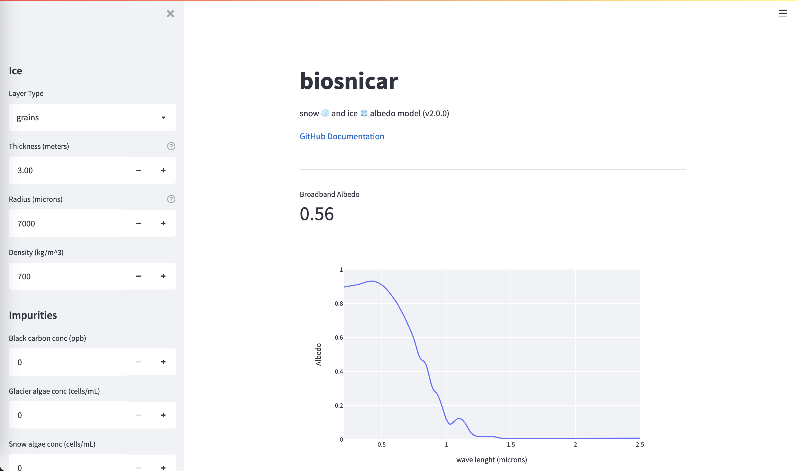

# BioSNICAR


## Introduction

BioSNICAR is a set of Python scripts that predict the spectral albedo of snow and glacier ice between 200nm to 5000nm given information about the illumination conditions, ice structure and the type and concentration of light absorbing particulates (LAPs) externally mixed with the snow/ice. The jumping off point for this model was legacy FORTRAN and Matlab code of the SNICAR model developed by Flanner et al. (2007), which solves the radiative transfer equations simplified into a two-stream scheme after Toon et al. 1989. Two solvers are available: the original SNICAR matrix solver typically representing ice and snow with grains (Toon et al. 1989) and the Adding-Doubling (AD) solver representing the ice as a solid medium with air bubbles and allowing the incorporation of Fresnel reflecting layers (Brieglib and Light, 2007, Dang et al. 2019, Wicker et al. 2022). BioSNICAR couples SNICAR to a bio-optical model that allows for calculation of optical properties of snow and glacier algae to load into the model as LAPs (Cook et al. 2017, 2020). This functionality, along with the vectorized AD solver formulation, accessible user interface and applicability to a very wide range of surface conditions are the unique selling points of this implementation. This code is also very actively maintained and we welcome contributions from the community to help make BioSNICAR a useful tool for a diverse range of cryosphere scientists.

## Documentation

Detailed documentation is available at https://biosnicar-go-py.readthedocs.io. This README gives a brief overview of the key information required to run the model.


## How to use

There are two ways to run the BioSNICAR model: 1) use the app; 2) run the code. The app is designed to be extremely user-friendly and require no coding skills. The app simply runs in the browser and is operated with a simple graphical user interface. However, the app only has basic functionality. Power-users will prefer to run the code directly to give access to all of BioSNICAR's functions. Both cases require a Python development environment with specific packages installed. The following section describes how to set up that environment.

### Installing Environment/Dependencies

If you do not have Python installed, download Python >3.8. It is recommended to use a fresh environment using conda or venv. Once activated, install the project dependencies with:

```
pip install -r requirements.txt

```

Now install biosnicar:

```

pip install -e .

```

Finally, if you do not wish to install anything on your computer, but you use VSCode and Docker, then you can use the devcontainer config provided to run this code in a remote container. This requires the "remote containers" extension to be added to VSCode. Further instructions are available here: https://code.visualstudio.com/docs/remote/containers

### Using the App

Instructions for using the app are provided below.

#### Run the app

The code for the Streamlit frontend is in `~/app/streamlit/app.py`.

In a terminal, navigate to the top-level BioSNICAR directory and run:


`./start_app.sh`

This starts the Streamlit server running on `http://localhost:8501`.




### Get albedo data

Simply update the values and the spectral albedo plot and the broadband albedo value will update on the screen. You can download this data to a csv file by clicking `download data`.

### Running the code

The model driver and all the core source code can be found in `/src/biosnicar`. From the top level directory (`~/BioSNICAR_GO_PY`), run:

`python ./src/biosnicar/snicar_driver.py`

This will run the model with all the default settings. The user will see a list of output values printed to the console and a spectral albedo plot appear in a separate window. The code can also be run in an interactive session (Jupyter/iPython) in which case the relevant data and figure will appear in the interactive console.

Most users will want to experiment with changing input parameters. This is achieved by adjusting the values in the config file `inputs.yaml`. The nature of each parameter is described in in-line annotations to guide the user. Invalid combinations of values will be rejected by our error-checking code. Most users should have no reason to modify any other file in this repository except for the those in `inputs.yaml`.

More complex applications of the model code, for example model inversions, field/model comparisons etc are included under `/experiments`, with details provided in that module's own README.

We have also maintained a separate version of the BioSNICAR codebase that uses a "functional" programming style rather than the object-oriented approach taken here. We refer to this as BioSNICAR Classic and it is available in the `classic` branch of this repository. it might be useful for people already familiar with FORTRAN or Matlab implementations from previous literature. The two branches are entirely equivalent in their simulations but very different in their programming style. The object oriented approach is preferred because it is more Pythonic, more flexible and easier to debug.

#### Choosing Inputs

It is straightforward to adjust the model configuration by updating the values in `inputs.yaml`. However there is a lot of nuance to setting up the model to provide realistic simulations, and the meaning of the various parameters is not always obvious. for this reason we have put together a guide. Please refer to the documentation at https://biosnicar-go-py.readthedocs.io


## Repository Structure

The following directory tree shows the correct structure for this model code. This is how the files are structured when this repository is cloned or downloaded. This can be used as a reference for understanding the software or as a guide if things get muddled during modification of the source code.

```
├── assets
│   ├── example-output.jpg
│   ├── model_schematic.odp
│   ├── model_structure2.jpg
│   ├── model_structure.jpg
│   ├── py_mat_comparison.png
│   └── SSA_derivation.pdf
|
├── bio_optical_model
│   ├── biooptical_driver.py
│   ├── biooptical_Funcs.py
│   ├── __pycache__
│   └── update_netCDFS.py
|
├── Data
│   ├── additional_data
│   │   ├── Albedo_master.csv
│   │   ├── ARF_master.csv
│   │   ├── Chlorophyll_a_m2mg.csv
│   │   ├── HCRF_master_16171819.csv
│   │   ├── InVivoPhenolData.csv
│   │   ├── PhenolicPigment_m2mg.csv
│   │   ├── phenol_mac_correction.csv
│   │   ├── phenol_MAC.csv
│   │   ├── phenol_mac_packaging_corrected.csv
│   │   ├── Photoprotective_carotenoids_m2mg.csv
│   │   ├── Photosynthetic_carotenoids_m2mg.csv
│   │   ├── pigmentMAC_200nm.csv
│   │   ├── pigmentMAC_250nm.csv
│   │   └── Spectra_Metadata.csv
│   ├── luts
│   │   └── LUT.npy
│   ├── OP_data
│   │   ├── 480band
│   │   │   ├── bubbly_ice_files
│   │   │   ├── fsds
│   │   │   ├── ice_hexagonal_columns
│   │   │   │   ├── ice_Pic16
│   │   │   │   ├── ice_Wrn08
│   │   │   │   └── ice_Wrn84
│   │   │   ├── ice_spherical_grains
│   │   │   │   ├── ice_Pic16
│   │   │   │   ├── ice_Wrn08
│   │   │   │   └── ice_Wrn84
│   │   │   ├── lap
│   │   │   ├── rain_polished_ice_spectrum.csv
│   │   │   └── r_sfc
│   │   │       ├── blue_ice_spectrum_s10290721.csv
│   │   │       └── rain_polished_ice_spectrum.csv
│   │   ├── ice_k.csv
│   │   ├── ice_n.csv
│   │   ├── ice_optical_constants.csv
│   │   ├── k_cdom_240_750.csv
│   │   ├── k_ice_480.csv
│   │   ├── Refractive_Index_Ice_Warren_1984.csv
│   │   ├── Refractive_Index_Liquid_Water_Segelstein_1981.csv
│   │   ├── water_RI.csv
│   │   └── wavelengths.csv
│   └── pigments
│       ├── alloxanthin.csv
│       ├── antheraxanthin.csv
│       ├── chl-a.csv
│       ├── chl-b.csv
│       ├── cis_astaxanthin_diester.csv
│       ├── cis_astaxanthin_monoester.csv
│       ├── lutein.csv
│       ├── neoxanthin.csv
│       ├── pckg_GA.csv
│       ├── pckg_SA.csv
│       ├── pheophytin.csv
│       ├── Photop_carotenoids.csv
│       ├── Photos_carotenoids.csv
│       ├── ppg.csv
│       ├── total_astaxanthin.csv
│       ├── trans_astaxanthin.csv
│       ├── trans_astaxanthin_ester.csv
│       ├── violaxanthin.csv
│       └── zeaxanthin.csv
├── experiments
│   ├── call_snicar.py
│   ├── config.yaml
│   ├── driver.py
│   ├── __init__.py
│   ├── __pycache__
│   ├── README.md
│   └── utils.py
|
├── LICENSE
├── README.md
├── requirements.txt
├── src
│   ├── biosnicar
│      ├── adding_doubling_solver.py
│      ├── bubble_reff_calculator.py
│      ├── classes.py
│      ├── column_OPs.py
│      ├── display.py
│      ├── geometric_optics_ice.py
│      ├── __init__.py
│      ├── inputs.yaml
│      ├── mie_coated_water_spheres.py
│      ├── __pycache__
│      ├── setup_snicar.py
│      ├── snicar_driver.py
│      ├── toon_rt_solver.py
│      └── validate_inputs.py
└── tests
    ├── conftest.py
    ├── __init__.py
    ├── matlab_benchmark_script.m
    ├── __pycache__
    ├── README.md
    ├── snicarAD_v4.m
    ├── test_data
    │   ├── matlab_benchmark_data_clean.csv
    │   ├── matlab_benchmark_data.csv
    │   ├── py_benchmark_data_clean.csv
    │   ├── py_benchmark_data.csv
    │   └── py_mat_comparison.png
    └── test_snicar.py
```


# Contributions

New issues and pull requests are welcomed. Pull requests trigger our Github Actions workflow to test for any breaking changes. PRs that pass these automated tests will be reviewed.

# Permissions

This code is provided under an MIT license with the caveat that it is in active development. Collaboration ideas and pull-requests generally welcomed. Please use the citations below to credit the builders of this repository and its predecessors.

# Citation

If you use this code in a publication, please cite:

Cook, J. et al. (2020): Glacier algae accelerate melt rates on the western Greenland Ice Sheet, The Cryosphere, doi:10.5194/tc-14-309-2020

Flanner, M. et al. (2007): Present-day climate forcing and response from black carbon in snow, J. Geophys. Res., 112, D11202, https://doi.org/10.1029/2006JD008003

And if using the adding-doubling method please also cite Dang et al (2019) and Whicker et al (2022) as their code was translated to form the adding_doubling_solver.py script here. The aspherical grain correction equations comes from He et al. (2016).


# References

Balkanski, Y., Schulz, M., Claquin, T., & Guibert, S. (2007). Reevaluation of Mineral aerosol radiative forcings suggests a better agreement with satellite and AERONET data. Atmospheric Chemistry and Physics, 7(1), 81-95.

Bidigare, R. R., Ondrusek, M. E., Morrow, J. H., & Kiefer, D. A. (1990, September). In-vivo absorption properties of algal pigments. In Ocean Optics X (Vol. 1302, pp. 290-302). International Society for Optics and Photonics.

Bohren, C. F., & Huffman, D. R. (1983). Absorption and scattering of light by small particles. John Wiley & Sons.

Briegleb, B. P., and B. Light. "A Delta-Eddington multiple scattering parameterization for solar radiation in the sea ice component of the Community Climate System Model." NCAR technical note (2007).

Clementson, L. A., & Wojtasiewicz, B. (2019). Dataset on the absorption characteristics of extracted phytoplankton pigments. Data in brief, 24, 103875.

Cook JM, et al (2017) Quantifying bioalbedo: A new physically-based model and critique of empirical methods for characterizing biological influence on ice and snow albedo. The Cryosphere: 1–29. DOI: 10.5194/tc-2017-73, 2017b

Cook, J. M. et al. (2020): Glacier algae accelerate melt rates on the western Greenland Ice Sheet, The Cryosphere Discuss., https://doi.org/10.5194/tc-2019-58, in review, 2019.

Dang, C., Zender, C., Flanner M. 2019. Intercomparison and improvement of two-stream shortwave radiative transfer schemes in Earth system models for a unified treatment of cryospheric surfaces. The Cryosphere, 13, 2325–2343, https://doi.org/10.5194/tc-13-2325-2019

Flanner, M. et al. (2007): Present-day climate forcing and response from black carbon in snow, J. Geophys. Res., 112, D11202, https://doi.org/10.1029/2006JD008003

Flanner, M et al. (2009) Springtime warming and reduced snow cover from
carbonaceous particles. Atmospheric Chemistry and Physics, 9: 2481-2497, 2009.

Flanner, M. G., Gardner, A. S., Eckhardt, S., Stohl, A., & Perket, J. (2014). Aerosol radiative forcing from the 2010 Eyjafjallajökull volcanic eruptions. Journal of Geophysical Research: Atmospheres, 119(15), 9481-9491.

Flanner, M. G. et al., SNICAR-ADv3: a community tool for modeling spectral snow albedo, Geosci. Model Dev., 14, 7673–7704, https://doi.org/10.5194/gmd-14-7673-2021, 2021.

He, C., Takano, Y., Liou, K. N., Yang, P., Li, Q., & Chen, F. (2017). Impact of snow grain shape and black carbon–snow internal mixing on snow optical properties: Parameterizations for climate models. Journal of Climate, 30(24), 10019-10036.

He, C., Liou, K. N., Takano, Y., Yang, P., Qi, L., & Chen, F. (2018). Impact of grain shape and multiple black carbon internal mixing on snow albedo: Parameterization and radiative effect analysis. Journal of Geophysical Research: Atmospheres, 123(2), 1253-1268.

Kirchstetter, T. W., Novakov, T., & Hobbs, P. V. (2004). Evidence that the spectral dependence of light absorption by aerosols is affected by organic carbon. Journal of Geophysical Research: Atmospheres, 109(D21).

Lee, E., & Pilon, L. (2013). Absorption and scattering by long and randomly oriented linear chains of spheres. JOSA A, 30(9), 1892-1900.

Picard, G., Libois, Q., & Arnaud, L. (2016). Refinement of the ice absorption spectrum in the visible using radiance profile measurements in Antarctic snow. The Cryosphere, 10(6), 2655-2672.

Polashenski et al. (2015): Neither dust nor black carbon causing apparent albedo decline in Greenland's dry snow zone: Implications for MODIS C5 surface reflectance, Geophys. Res. Lett., 42, 9319– 9327, doi:10.1002/2015GL065912, 2015.

Skiles, S. M., Painter, T., & Okin, G. S. (2017). A method to retrieve the spectral complex refractive index and single scattering optical properties of dust deposited in mountain snow. Journal of Glaciology, 63(237), 133-147.

Toon, O. B., McKay, C. P., Ackerman, T. P., and Santhanam, K. (1989), Rapid calculation of radiative heating rates and photodissociation rates in inhomogeneous multiple scattering atmospheres, J. Geophys. Res., 94( D13), 16287– 16301, doi:10.1029/JD094iD13p16287.

van Diedenhoven et al. (2014): A flexible paramaterization for shortwave opticalproperties of ice crystals. Journal of the Atmospheric Sciences, 71: 1763 – 1782, doi:10.1175/JAS-D-13-0205.1

Warren, S. G. (1984). Optical constants of ice from the ultraviolet to the microwave. Applied optics, 23(8), 1206-1225.

Warren, S. G., & Brandt, R. E. (2008). Optical constants of ice from the ultraviolet to the microwave: A revised compilation. Journal of Geophysical Research: Atmospheres, 113(D14).

Whicker et al., Halbach et al., Chevrollier et al. coming soon!
