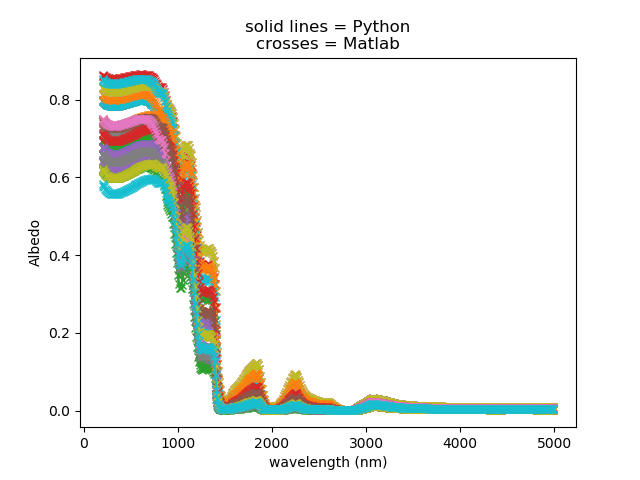

*******
Testing
*******

This repository contains a set of executable tests that anyone can run independently to verify the codebase against a Matlab benchmark version (published in Whicker et al 2021) along with a fuzzer that tests that the model runs and returns valid results across a wide parameter space. The fuzzer can be configured for specific ranges of values by adjusting the `pytest.mark.parameterize` statements in `test_snicar.py`, or just use our recommended defaults. The fuzzer can be toggled off by setting `fuzz = 0` in `conftest.py`. Tests are organised in `/tests` but are run from the top level directory so that the model code can be more conveniently imported as modules into the test session. Therefore, to run the tests, simply navigate to the top level directory and run:

.. code-block:: python3
  $ pytest tests

This will open two datasets containing 5000 simulations replicated in the Python and Matlab implementations. Sucessfully passing tests are reported in the console as green dots, and pytest will return a summary of N tests passed and N tests failed. A figure showing N pairs of spectra is saved to the /tests folder for visual inspection. Any failures will be documented in the terminal so that they can be analysed and any bugs fixed. In the downloaded version of this repo, 100% of 1060 individual tests pass.

This demonstrates physically realistic predictions and equivalency between the two codebases to at least 1e-8 albedo units. The great majority of the simulations match to within 1e-12.

More tests can and will be added over time (please feel free to contribute tests)!

The model configuration used to generate the data used to drive the automated tests can be found in the `matlab_benchmark_script.m` and `python_benchmark_script.py` files. The Python version calls functions in `py_benchmarking_funcs.py` The matlab version was run on a linux server at UMich, the Python version was run locally by the repository owner on Ubuntu 20.04. 
